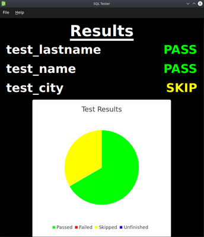

# QSqlTest

A library, command-line runner, and graphical interface for creating and executing data-driven SQL tests.

*JSON example below is obsolete. See [./tests/fixtures/superheroes.json](./tests/fixtures/superheroes.json) for a more up-to-date example.*

 

**This is still a WIP, and not ready for production workflows.**

## About

I came up with the idea for this project at my job.
Our branch involves writing a lot of SQL queries to modify or verify tables.

SQL queries are notoriously difficult to test, so I created a tool that allows queries to be tested by specifying input data to be loaded into a temporary table, executing a query, and then comparing the actual results to the expected output.

## Roadmap

* [x] Decide on first JSON schema.
* [x] Support SQLite (in-memory).
* [x] Add command-line interface.
* [x] Colored logging.
* [ ] Refactor API.
* [x] Add CI/CD with GitHub Actions.
* [ ] Support more SQL databases (Oracle, MySQL, existing SQLite databases).
* [ ] Add support for UPDATE queries.
* [ ] Finalize JSON schema.
* [x] Finish GUI MVP.

## Using

Tests are specified using a JSON file format.

| Key               | Description                                                           | Required? |
| ----------------- | --------------------------------------------------------------------- | --------- |
| `name`            | Suite name.                                                           | Yes       |
| `database.driver` | SQL database driver to use. Currently supports _sqlite_.              | Yes       |
| `queries`         | Map of SQL queries used (see below).                                  | Yes       |
| `tables`          | Table schemas to use when creating tables (see below).                | Yes       |
| `tests`           | List of unit tests to execute (see below).                            | Yes       |

Refer to [./tests/fixtures/superheroes.json](./tests/fixtures/superheroes.json) for an example.

### `queries`

A map of named SQL queries. Queries should use `{{TABLE_VAR}}` syntax instead of referring to tables directly.
Variables will be replaced with temporary test table names at runtime.

### `tables`

A map of table names to definitions. Each table should define its schema here. Order is important; columns will be created in the order they are given.

### `tests`

The main entry point; a list of all SQL unit tests to execute.
Each unit test must specify the following:

| Name | Description |
| ---- | ----------- |
| `query` | Name of the query in `queries` to use for this test. |
| `results` | Output data. Either the results returned by a SELECT query, or the table data after running an UPDATE query. |
| `tables` | A map of table names to CSV input files to populate the table with. |
| `variables` | A map of variable names to replacement values. |

## License

Source code is licensed under the [MIT](LICENSE.md).
